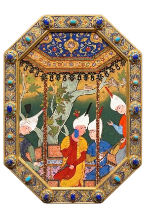

# ParsBench: A Persian Cultural Commonsense Benchmark
ParsBench can be used to evaluate both open-weight and proprietary models. In our experiments, we evaluate several LLMs and MLLMs across the benchmark components, including open-source models and proprietary systems such as GPT-5-mini.
The benchmark is intended to support comparative analysis of how well current models perform on Persian culturally grounded reasoning. 

  

## Why ParsBench?

Most existing benchmarks are either English-centric or focus on general language and knowledge evaluation. As a result, they often fail to capture culturally specific reasoning in non-English contexts.

ParsBench is designed to evaluate whether models can understand Persian cultural concepts, interpret culturally meaningful visual cues, and reason about social practices, traditions, idioms, places, foods, and symbolic meanings.
## Benchmark Components

ParsBench consists of complementary components designed to evaluate different aspects of Persian cultural understanding:

| Component | Task Type | Goal |
|---|---|---|
| Expert-QA | Multiple-choice QA | Evaluates expert-verified Persian cultural reasoning |
| Reasoning-QA | Reasoning-focused QA | Tests culturally grounded inference and commonsense reasoning |
| LFQA | Long-form QA | Evaluates open-ended cultural explanation |
| Multimodal QA | Image-text QA | Tests visual cultural understanding in MLLMs |

## Key Features

- Native Persian benchmark construction
- Focus on culturally grounded commonsense reasoning
- Human-verified questions and answers
- LLM-assisted but human-validated dataset construction
- Multiple task formats: MCQ, reasoning QA, LFQA, and multimodal QA
- Evaluation of both LLMs and MLLMs
- Coverage of diverse Persian cultural domains
- ## Cultural Domains

ParsBench covers a wide range of Persian cultural domains, including:

- Traditions
- Food
- Idioms
- Literature
- Religion
- History
- Geography
- Festivals
- Souvenirs
- Official days
- Music
- Media
- Games
- Herbal knowledge
- Social norms
